

<!--
*** Thanks for checking out the Best-README-Template. If you have a suggestion
*** that would make this better, please fork the repo and create a pull request
*** or simply open an issue with the tag "enhancement".
*** Don't forget to give the project a star!
*** Thanks again! Now go create something AMAZING! :D
-->

<!-- PROJECT SHIELDS -->
<!--
*** I'm using markdown "reference style" links for readability.
*** Reference links are enclosed in brackets [ ] instead of parentheses ( ).
*** See the bottom of this document for the declaration of the reference variables
*** for contributors-url, forks-url, etc. This is an optional, concise syntax you may use.
*** https://www.markdownguide.org/basic-syntax/#reference-style-links
-->
[![Contributors][contributors-shield]][contributors-url]
[![Forks][forks-shield]][forks-url]
[![Stargazers][stars-shield]][stars-url]
[![Issues][issues-shield]][issues-url]
[![MIT License][license-shield]][license-url]
[![LinkedIn][linkedin-shield]][linkedin-url]

<!-- PROJECT LOGO -->
 

  

  <h3 align="center">Best-README-Template</h3>

  

    An awesome README template to jumpstart your projects!
     
    <a href="https://github.com/othneildrew/Best-README-Template"><strong>Explore the docs »</strong></a>
     
     
    <a href="https://github.com/othneildrew/Best-README-Template">View Demo</a>
    ·
    <a href="https://github.com/othneildrew/Best-README-Template/issues">Report Bug</a>
    ·
    <a href="https://github.com/othneildrew/Best-README-Template/issues">Request Feature</a>
  

 </head>
    <body>
      
 <h1>Dashboard Visualisasi Data  Interaktif Kemiskinan dan Ketimpangan Provinsi Sumatera Barat Tahun 2016-2021</h1>
    </body> 

<!-- TABLE OF CONTENTS -->

  
Table of Contents

  <ol>
    <li>
      <a href="#about-the-project">About The Project</a>
      <ul>
        <li><a href="#built-with">Built With</a></li>
      </ul>
    </li>
    <li>
      <a href="#getting-started">Getting Started</a>
      <ul>
        <li><a href="#prerequisites">Prerequisites</a></li>
        <li><a href="#installation">Installation</a></li>
      </ul>
    </li>
    <li><a href="#usage">Usage</a></li>
    <li><a href="#roadmap">Roadmap</a></li>
    <li><a href="#contributing">Contributing</a></li>
    <li><a href="#license">License</a></li>
    <li><a href="#contact">Contact</a></li>
    <li><a href="#acknowledgments">Acknowledgments</a></li>
  </ol>

<!-- ABOUT THE PROJECT -->
## Dashboard Visualisasi Data Interaktif

<a href="https://github.com/othneildrew/Best-README-Template">
    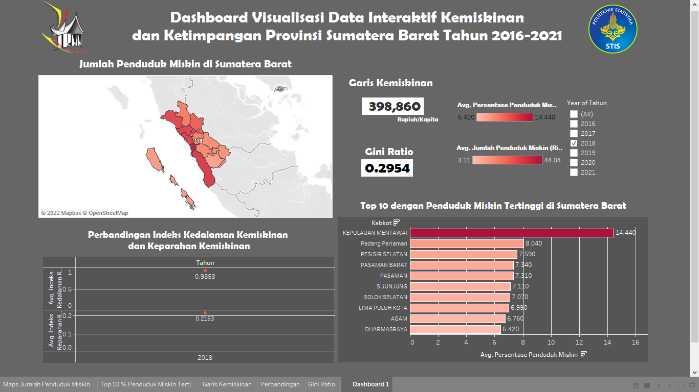

 [https://public.tableau.com/app/profile/vania.tresa.ramanel/viz/DashboardVisualisasiDataInteraktifKemisikinandanKetimpanganProvinsiSumateraBaratTahun2016-2021/Dashboard1](https://public.tableau.com/app/profile/vania.tresa.ramanel/viz/DashboardVisualisasiDataInteraktifKemisikinandanKetimpanganProvinsiSumateraBaratTahun2016-2021/Dashboard1)

 
Kemiskinan menjadi salah satu permasalahan yang tidak bisa dihindari oleh suatu daerah. Masalah kemiskinan merupakan hal yang kompleks dan bersifat multidimensional yang dihadapi oleh tiap wilayah berbagai provinsi di Indonesia begitu juga halnya oleh Pemerintah Provinsi Sumatera Barat. Adanya tampilan data indikator kemiskinan dan ketimpangan yang dikeluarkan oleh BPS selama ini masih cendrung berbentuk tabel bersifat manual per satuan wilayah dan periode tertentu yang di input dalam excel, sehingga masih kurang efisien.

Dari permasalahan yang ada, dibuat sebuah dashboard visualisasi data interaktif dalam berbagai bentuk visualisasi yang akan memudahkan pengguna untuk mendapatkan informasi secara efektif san efisien.

Dashboard visualisasi data interaktif menggunakan data indikator persentase penduduk miskin, jumlah penduduk miskin, indeks kedalaman kemiskinan, indeks keparahan kemiskinan, gini ratio, dan garis kemiskinan menurut Kabupaten/Kota Provinsi Sumatera Barat Tahun 2016-2021 yang didapatakn secara online dari BPS Provinsi Sumatera Barat pada situs [https://sumbar.bps.go.id/](https://sumbar.bps.go.id/)

Dashboard dibuat menggunakan aplikasi Tableau Desktop. Dashboard dibuat interaktif berdasarkan 5 worksheet diantaranya Peta temataik jumlah penduduk miskin, Perbandingan indeks kedalaman dan keparahan kemiskinan, Top 10 penduduk miskin tertinggi, Garis kemiskinan, dan Gini ratio.

Dashboard visualisasi ini ditampilkan pada Tableau Public, sehingga semua orang bisa melihat dashboard visualisasi data interaktif melalui internet. Melalui dashboard tersebut diharapkan semua orang bisa mendapatkan informasi tentang indikator kemiskinan dengan efektif dan efisien melalui fitur yang telah disediakan.
 

Use the `BLANK_README.md` to get started.

(<a href="#top">back to top</a>)

### Tools Pembuatan Dasboard
 
Selanjutnya, akan dijabarkan berbagai tools yang digunakan dalam pembuatan Dashboard Visualisasi Data Interaktif Kemiskinan dan Ketimpangan Provinsi Sumatera Barat Tahun 2016-2021.

* [Tableau](https://public.tableau.com/)
  
  Tools yang akan digunakan dalam melakukan penelitian ini yaitu menggunakan tools Tableau yang merupakan software yang mudah digunakan dalam menvisualisasi data kedalam bentuk visual. Tableau adalah perangkat lunak bisnis intelijen yang mudah untuk digunakan, terutama dalam hal membuat visualisasi data, analisis data, dan pelaporan.
* [QGis](https://qgis.org/en/site/)
  
  Tools yang digunakan untuk memfilter provinsi Sumatera Barat dari peta tematik dalam bentuk vektor yang dijadikan file (.shp). Tujuan penggunaan QGis adalah untuk mendapatkan titik latitude dan longtitude agar menghasilkan geometry yang akan di gunakan di aplikasi Tableau
   
  

(<a href="#top">back to top</a>)

<!-- GETTING STARTED -->
## Proses Pembuatan Dashboard Visualisasi Data Interaktif
 
<h3> Proses pembuatan Visualisasi Data Interaktif Menggunakan Tableau sebagai berikut : </h3> 
 

### 1. Seleksi dan Pemilihan Data

Data yang digunakan yaitu berupa indikator persentase penduduk miskin, jumlah penduduk miskin, indeks kedalaman kemiskinan, indeks keparahan kemiskinan, gini ratio, dan garis kemiskinan menurut Kabupaten/Kota Provinsi Sumatera Barat Tahun 2016-2021. Kemudian semua data tersebut akan di download dalam satu file excel
 
Data indeks Kemiskinan dan Ketimpangan sebelum di seleksi :

  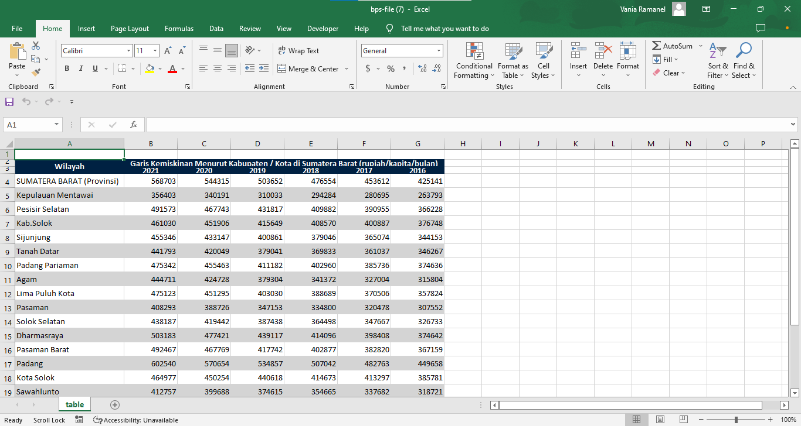

Dataset yang tersedia dari tabel BPS yaitu wilayah kabupaten/kota, kolom selanjutnya yaitu kolom tahun 2016-2021 berdasarkan indikator yang digunakan.

 
Kemudian akan dikelompokkan berdasarkan tahun serta kabupaten/kota di Provinsi Sumatera Barat. Sebagai berikut ini :
 

  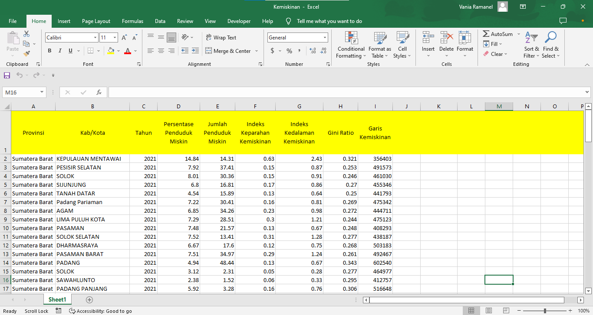

Setelah dilakukan pemilihan data, maka dilakukan seleksi data dengan menggabungkan dataset tersebut dalam satu file excel. Nantinya akan digunakan sebagai file pada Aplikasi Tableau.
Dataset tersebut terdiri dari : Provinsi, Kab/Kota, Tahun, Persentase penduduk miskin, Jumlah penduduk miskin, Indeks kedalaman kemiskinan, Indeks keparahan kemiskinan, Gini ratio, dan Garis kemiskinan.
Selain itu juga menggunakan dataset dalam bentuk sumbar.shp, datasetnya terdiri dari kabkot, kabkotno, provinsi1, provno, dan geometry. 

  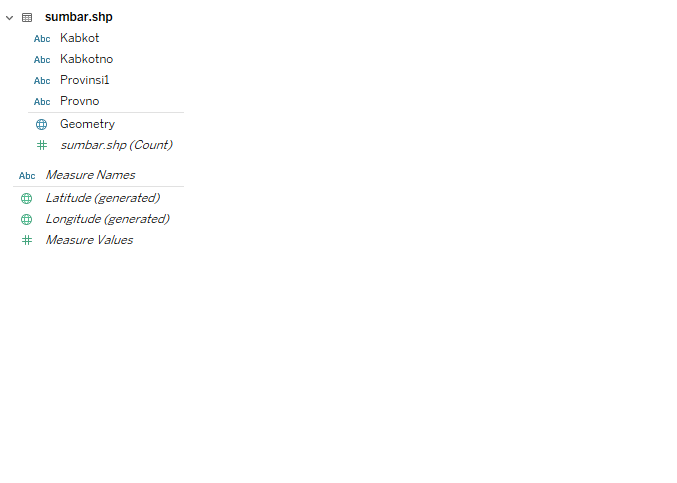

Dataset kab/kota yaitu sebagai penghubung antara kedua data tersebut yaitu file excel dan shp.

 

### 2. Visualisasi Data Interaktif

Data yang telah diseleksi kemudian divisualisasikan menggunakan apilkasi Tableau. Alasan digunakannya software ini karena penggunaannya yang mudah serta fitur-fitur yang lengkap untuk pembuatan dashboard ini. Setiap data akan diihitung sehingga akan mudah pada saat divisualisasikan.

Visualisasi dibuat interaktif berdasarkan 5 worksheet diantaranya Peta temataik jumlah penduduk miskin, Perbandingan indeks kedalaman dan keparahan kemiskinan, Top 10 penduduk miskin tertinggi, Garis kemiskinan, dan Gini ratio.

Visualisasi yang akan digunakan yaitu :
 
* <h3>Visualisasi Peta (Choropleth) </h3>
  
  Choropleth untuk menampilkan persebaran jumlah penduduk miskin di kabupaten/kota Provinsi Sumatera Barat yang akan difilter berdasarkan tahun 2016 hingga 2021. 

  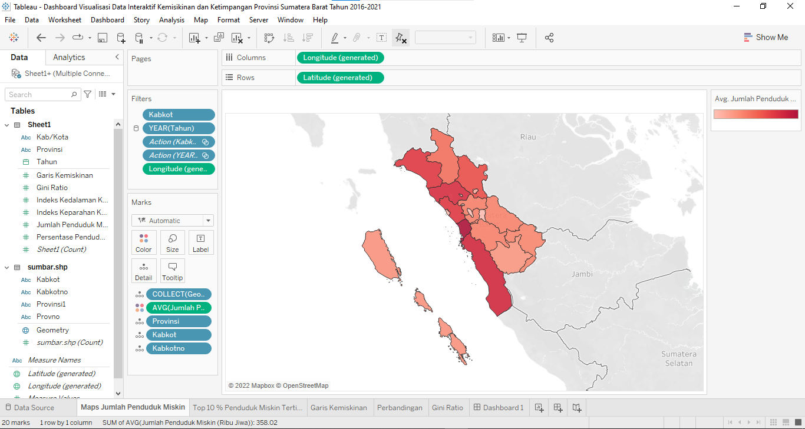

Pada aplikasi Tableau, visualisasi yang digunakan dalam bentuk Choropleth. Penggunaan data jumlah penduduk miskin yang diimplementasikan kedalam bentuk data interaktif dengan memfilter kabupaten/kota dan tahun serta memberikan Action disetiap filternya tersebut.
Terlihat bahwa, Geometri, provinsi, kabkot, kabkotno disajikan dalam bentuk detail. Sedangkan AVG (Jumlah Pendududuk disajikan dalam bentuk color). Dimana pada legenda, semakin pekat warna maka semakin tinggi nilainya.
 

 

* <h3>Linechart </h3>
  
  Linechart untuk menampilkan dan menyajikan perbandingan indeks kedalaman kemiskinan dan indeks keparahan kemiskinan yang akan difilter setiap tahunnya.

  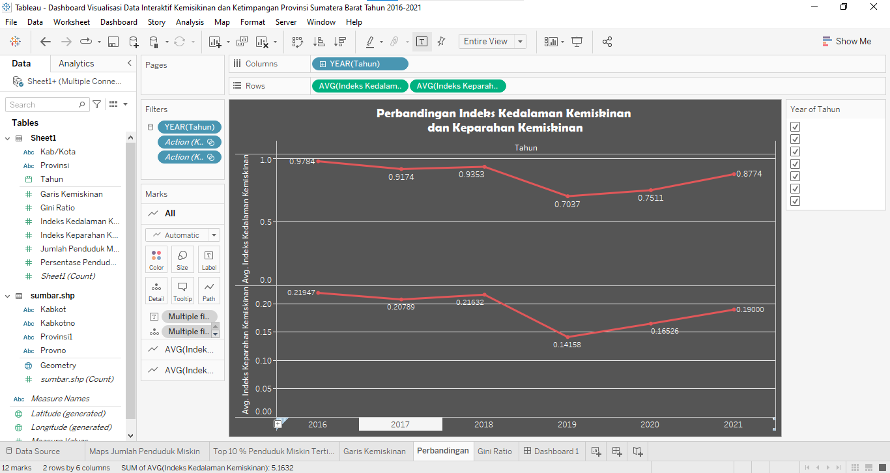

Pada aplikasi Tableau, visualisasi yang digunakan dalam bentuk Linechart. Penggunaan data Indeks Kedalaman dana keparahan Kemiskinan yang diimplementasikan kedalam bentuk data interaktif dengan memfilter kabupaten/kota dan tahun serta memberikan Action disetiap filternya tersebut.
Terlihat bahwa, AVG (Indeks Kedalaman Kemiskinan) dan AVG (Indeks Keparahan Kemiskinan) dalam bentuk detail dan teks. 
 

 

* <h3>Barchart </h3>

Bacrhart untuk menyajikan dan melihat Top 10 kabupaten/kota dengan penduduk miskin tertinggi di Sumatera Barat yang dapat di filter setiap tahunnya. 

  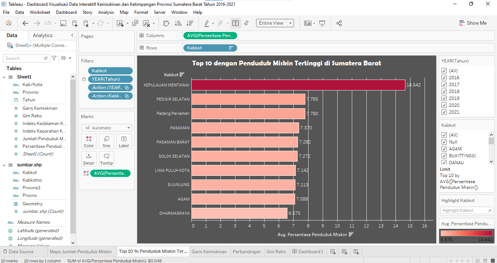

Pada aplikasi Tableau, visualisasi yang digunakan dalam bentuk Barchart. Penggunaan data Persentase penduduk miskin yang diimplementasikan kedalam bentuk data interaktif dengan memfilter kabupaten/kota dan tahun serta memberikan Action disetiap filternya tersebut.
Terlihat bahwa, AVG (Persentase penduduk miskin) dalam bentuk color. Pada tampilan terlihat semakin pekat warna maka semakin tinggi nilainya.
 

 

* <h3>Data Interaktif </h3>

Menyajikan data garis kemiskinan dan gini ratio yang dapat difilterkan berdasarkan wilayah dan tahun.

  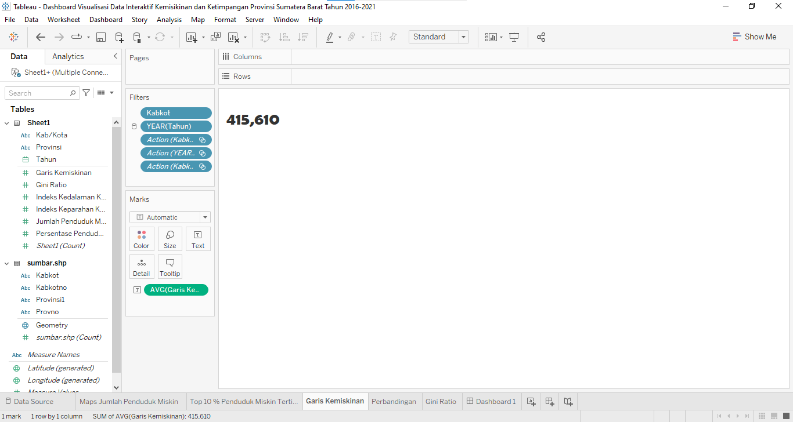

  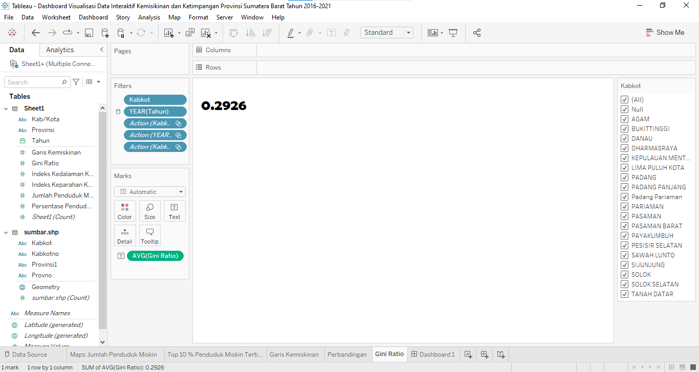

Pada aplikasi Tableau, visualisasi yang digunakan dalam bentuk Data Interaktif. Penggunaan data Garis kemiskinan dan Gini Ratio yang diimplementasikan kedalam bentuk data interaktif dengan memfilter kabupaten/kota dan tahun serta memberikan Action disetiap filternya tersebut.
Terlihat bahwa, AVG (Garis kemiskinan) dan AVG (Gini ratio) dalam bentuk teks. Pada tampilan terlihat nilai dari indikator tersebut berdasarkan wilayah dan tahun.
 

 

  ### 3. Pembuatan Dashboard

Semua visualisasi akan digabungkan dan disatukan dalam bentuk dashboard sehingga akan dimuat berbagai informasi mengenai Kemiskinan dan Ketimpangan untuk semua kabupaten/kota di Provinsi Sumatera Barat dari tahun 2016 hingga 2021 menerapkan visualisasi data interaktif yang memanfaatkan penggunaan filter untuk wilayah dan tahun. Setelah seluruh data dibuat visualisasinya, lalu digabung dan disatukan seluruh visualisasi yang dibuat dalam bentuk dashboard. 

  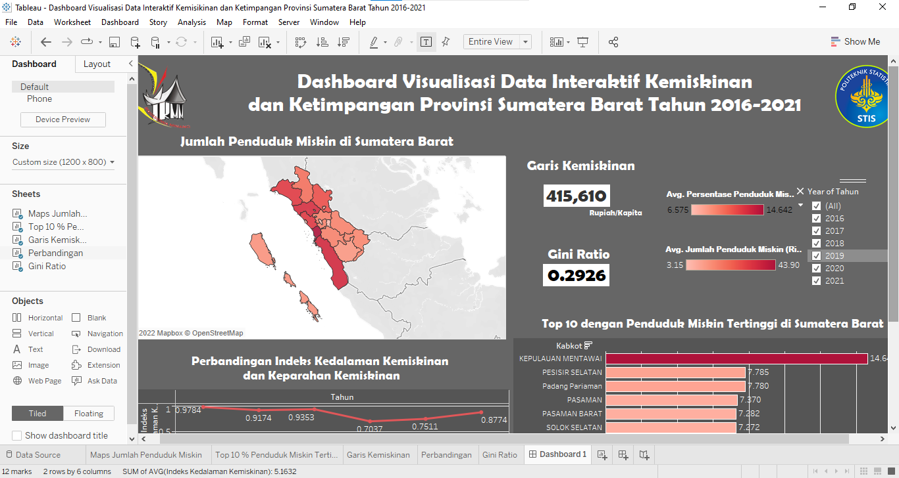

Pembuatan dashboard ini harus memperhatikan kepaduan warna serta tata letak visualisasi. Dashboard yang baik adalah dashboard yang proporsional dalam mengatur penyusunan visualisasinya dan pewarnaan. Dashboard yang baik tidak boleh mengandung unsur yang mencolok sehingga informasi yang ada pada visualisasi tidak tersmpaikan dengan baik. 

Pembuatan dashboard ini dirancang menggunaan pewarnaan menggunaan palette color yang sudah ada pada tableau yaitu red pallete color dan background black. Pada tableau, ukuran dashboard yang digunakan yaitu 1200 x 800 pixel. 

 
Dalam pembuatan dashboard, Agar tampilan terlihat menarik dan interaktif. Penelitian memanfaatkan fitur yang telah disediakan pada aplikasii Tableau.  Penerapannya yaitu:
<h4>1. Select Dashboard pada aplikasi</h4>
<h4>2. Klik Action</h4>
<h4>3. Klik Add action</h4>
<h4>4. Pilih Filter</h4>
<h4>5. Klik Show all value</h4>
Juga bisa menggunakan fitur filter lalu pilih category dan tabel(tahun) untuk di select all using data source.
 

 

  ### 4. Publish Dashboard Visualisasi Data Interaktif
  Hasil publikasi pada Tableau Public dapat diakses melalui link : 
[https://public.tableau.com/app/profile/vania.tresa.ramanel/viz/DashboardVisualisasiDataInteraktifKemisikinandanKetimpanganProvinsiSumateraBaratTahun2016-2021/Dashboard1](https://public.tableau.com/app/profile/vania.tresa.ramanel/viz/DashboardVisualisasiDataInteraktifKemisikinandanKetimpanganProvinsiSumateraBaratTahun2016-2021/Dashboard1)  
Tableau public merupakan sarana yang digunakan untuk publikasi visualisasi data yang telah dibuat. Visualisasi data yang telah dibuat dapat diakses secara daring oleh orang lain.

  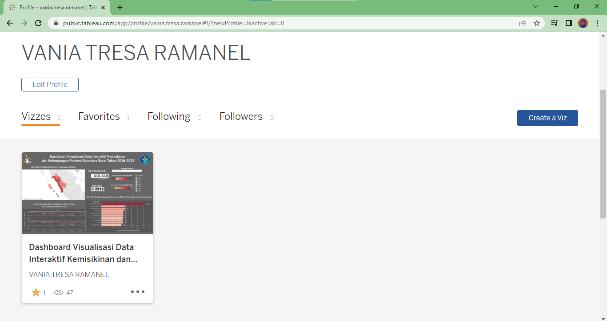

  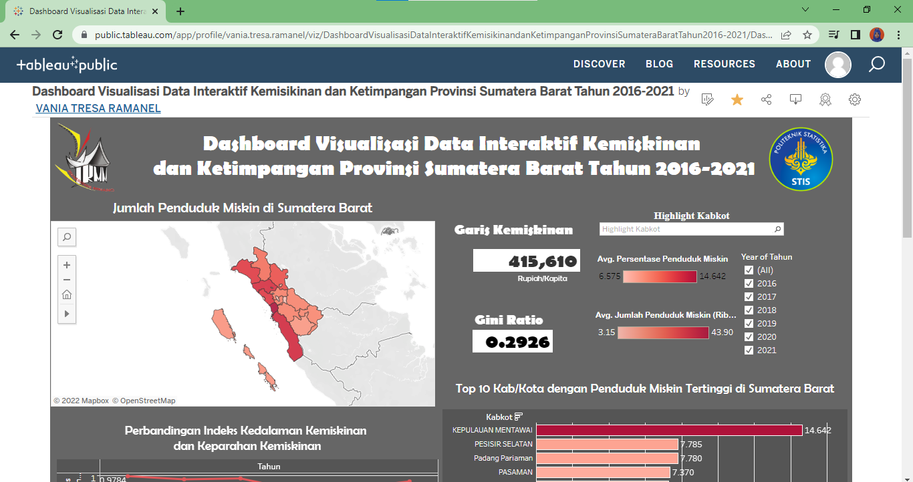

Setelah di upload pada Tableau Public, maka Dashboard akan dapat diakses oleh siapun dan memanfaatkan Dashboard Visualisasi Data Interaktif yang telah kita buat dengan efektif dan efisien.

 

<!-- USAGE EXAMPLES -->
## Implementasi

Penggunaan Dashboard yang telah di public dengan memanfaatkan fitur-fitur yang telah disediakan dalam pemilihan kabupaten/kota dan tahun
 
Contoh Implementasi :
 

  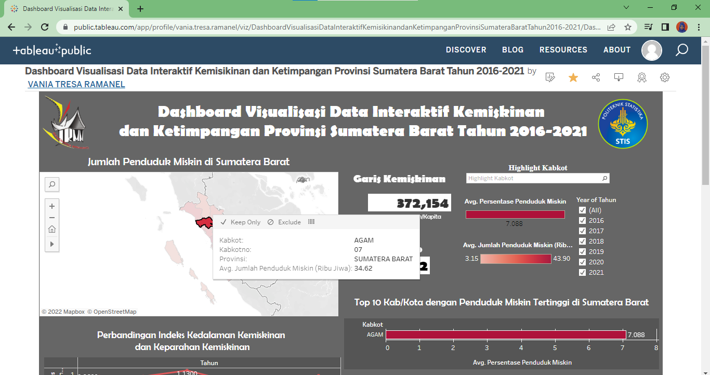

Terlihat bahwa, penggunaan dashboard visualisasi data ini yaitu menggunakan all fitur tahun dan mengklik salah satu daerah di Sumatera Barat yaitu kabkot Agam. Pada dashboard, didapatkan informasi kabkot : Agam, kabkotno : 07, provinsi : Sumatera Barat, dan AVG Jumlahh penduduk : 34.62. Selain itu pada visualisasi linechart, barchart, dan data interaktif mengalami perubahan sesuai fitur yang dipilih. seperti kita lihat bahwa, Kabkot Agam termasuk ke dalam 10 Top Penduduk miskin tertinggi di Sumatera Barat dengan AVG Peresentase penduduk miskin yaitu sebesar 7.088% dengan legendanya menunjuk warna yang merah. Serta Garis kemiskinan diketahui nilainya sebesar 372.154 rupiah/kapita.

  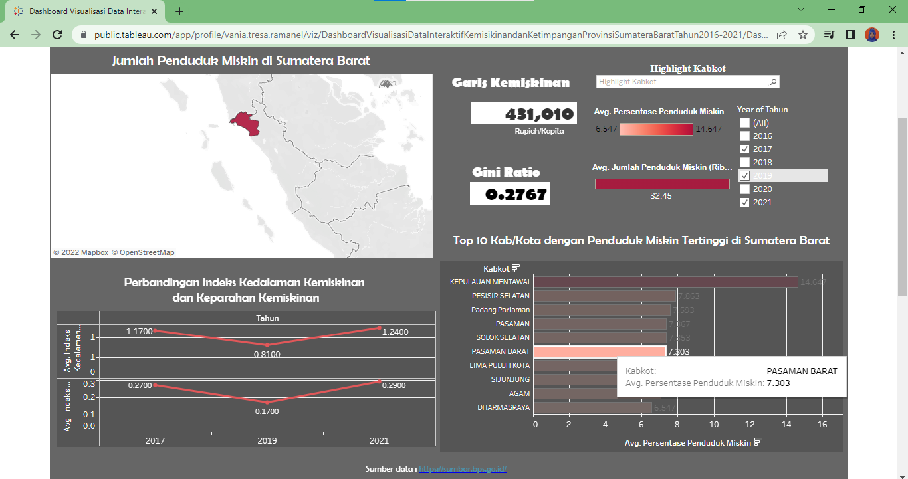

Terlihat bahwa, penggunaan dashboard visualisasi data ini yaitu menggunakan fitur tahun dengan tahun 2017, 2019, dan 2021. Dengan mengklik salah satu daerah di Sumatera Barat pada barchart yaitu kabkot Pasaman Barat. Pada dashboard, didapatkan informasi kabkot : Pasaman Barat, dan AVG Persentase penduduk miskin : 7.303%. Selain itu pada visualisasi linechartdan data interaktif mengalami perubahan sesuai fitur yang dipilih. seperti kita lihat bahwa, nilai Garis Kemiskinan sebesar 431.010 rupiah/perkapita dan Gini ratio sebesar 0.2767 dengan legendanya menunjuk warna yang pink. Serta linechart diketahui berbentuk seperti v.

  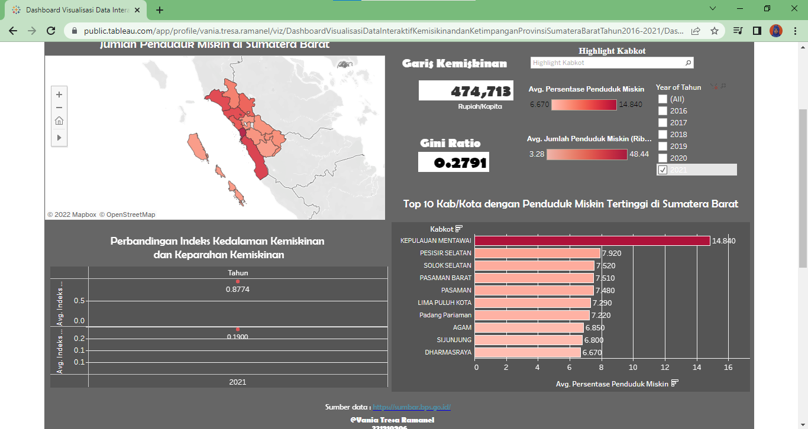

Terlihat bahwa, penggunaan dashboard visualisasi data ini yaitu menggunakan fitur tahun hanya pada tahun 2021. Maka, pada dashboard, didapatkan informasi semua visualisasi peta tematik, linechart, barchart, dan data interaktif mengalami perubahan sesuai fitur yang dipilih yaitu berdasarkan tahun 2021. Seperti kita lihat bahwa, nilai Garis Kemiskinan sebesar 474.713 rupiah/perkapita dan Gini ratio sebesar 0.2791 dengan adanya tampilan legenda. Serta linechart diketahui seperti titik yang menuju pada tahun 2021.

  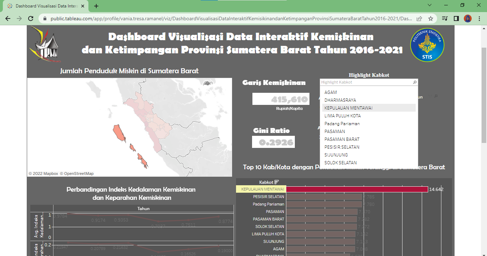

Terlihat bahwa, penggunaan dashboard visualisasi data ini yaitu menggunakan fitur pemilihan kabupaten/kota yaitu pilihan pada Highlight kabkot. Kabkot yang dipilih ialah kabkot Kepulauan Mentawai. Maka, pada dashboard, didapatkan informasi visualisasi peta tematik dan barchart mengalami perubahan sesuai fitur yang dipilih yaitu berdasarkan wilayah yang diplih. Seperti kita lihat bahwa, kabkot : Kepulauan Mentawai, dan AVG Persentase penduduk miskin : 14.642%.

  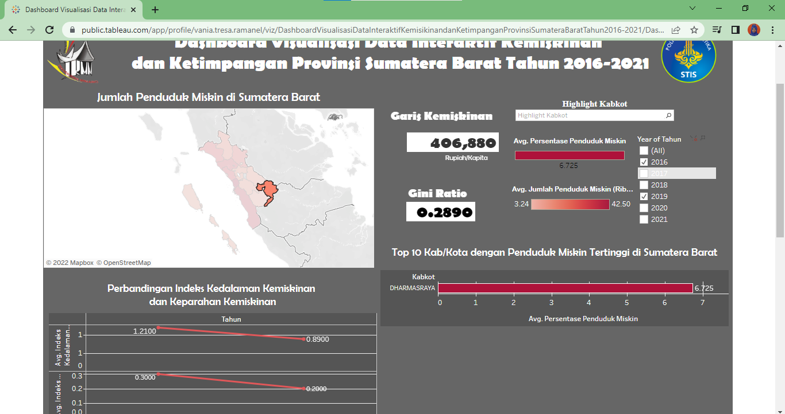

Terlihat bahwa, penggunaan dashboard visualisasi data ini yaitu menggunakan fitur tahun dengan rentang tahun 2016 dan 2021 saja dan mengklik kabkot Dharmasraya pada peta tematik. Maka, pada dashboard, didapatkan informasi semua visualisasi peta tematik, linechart, barchart, dan data interaktif mengalami perubahan sesuai fitur yang dipilih yaitu berdasarkan tahun 2016 dan 2021 serta wilayahnya yaitu kabkot Dharmasraya. Seperti kita lihat bahwa, nilai Garis Kemiskinan sebesar 406.880 rupiah/perkapita dan Gini ratio sebesar 0.2890 dengan adanya tampilan legenda. Linechart diketahui seperti garis yang membentang pada tahun 2016 dan 2021. Serta Barchart yang menunjukkan warna merah.

(<a href="#top">back to top</a>)

<!-- CONTRIBUTING -->
## Evaluasi

Belum dilakukannya evaluasi terhadap dashboard yang telah dibangun.

(<a href="#top">back to top</a>)

<!-- CONTACT -->
## Contact

Vania Tresa Ramanel - [@vania_ramanel](https://www.instagram.com/vania_ramanel) - 221910906.stis.ac.id

Project Link: [https://github.com/VaniaRamanel28/Dashboard-Visualisasi-Data-Interaktif-Kemiskinan](https://github.com/VaniaRamanel28/Dashboard-Visualisasi-Data-Interaktif-Kemiskinan)

(<a href="#top">back to top</a>)

